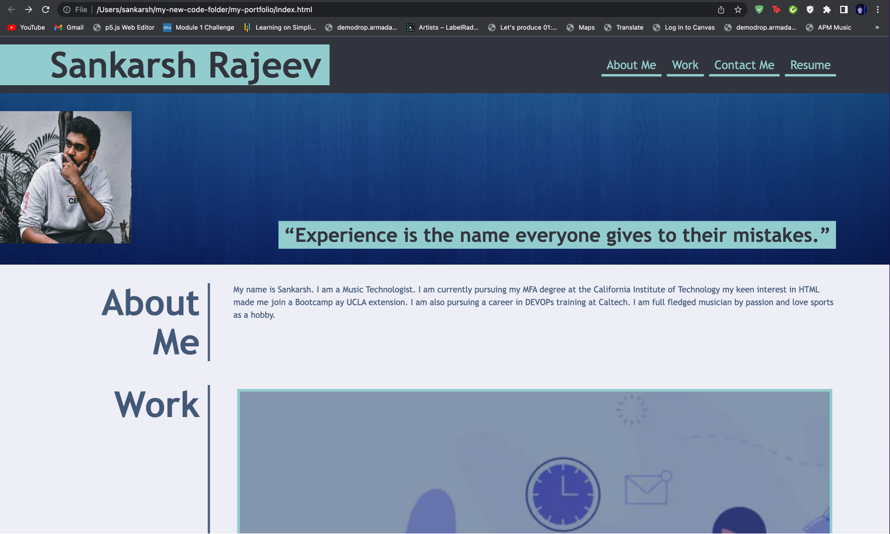

# My-Portfolio

## Description
 - My motivation was to create a professional looking website where I could present my work and build my website as I continue on with the course.
 - Had to get my CSS practise in and add flexbox and other parameters to make a professional looking website.
 - It compiles all my coding techniques and projects in a book manner where it can viewed on any screen with precison.
 - I learnt how to properly use a flexbox and how different fonts and styling can be applied for it to work.

 ## Link to WebPage

Use the following link to view the page

 https://sankyrajeev.github.io/my-portfolio/

This is how my webpage looks like

   md